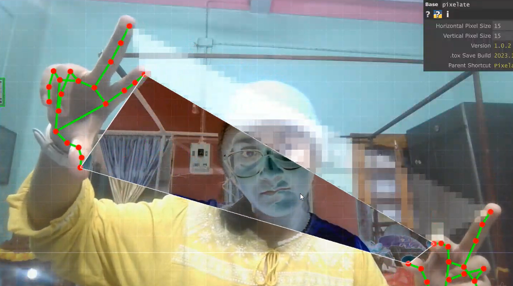

# Hand-Tracked Geometric Pixelation

A beginner TouchDesigner project exploring real-time hand tracking combined with geometric forms and pixelation.

This project was inspired by Instagram reels set to the song *“I Hope You Find Some Peace of Mind”*. Most of those reels were made with traditional video editing. I wanted to try a similar aesthetic using live interaction instead.

**Demo Video**  
https://youtu.be/qGwkrI9Rke0

**Tutorial Followed**  
https://youtu.be/om4VRC4TU_o

---

## What This Project Does

- Real-time hand tracking using MediaPipe (red landmarks + green skeleton)
- Large geometric shapes (triangular/polygonal forms) that respond to hand movement
- A pixelation effect applied over the video
- Everything runs live from a webcam

The overall look is soft, fragmented, and geometric.

---

## Requirements

- TouchDesigner 2025.32820 (or a compatible recent version)
- MediaPipe TouchDesigner Plugin by Torin Blankensmith  
  → https://github.com/torinmb/mediapipe-touchdesigner/releases

---

## How to Open This Project

1. Download this repository and unzip it.
2. Download the latest **release.zip** of the MediaPipe plugin from the link above and unzip it.
3. Place the `toxes` folder from the MediaPipe release **next to** the `.toe` file.
4. Open `Hand_Tracking.2.toe` in TouchDesigner.
5. If you see a warning about a missing external tox:
   - Select the MediaPipe component
   - Go to the Common page
   - Turn on **Enable External .tox**
   - Point it to `toxes/MediaPipe.tox`
6. Allow webcam access.

---

## Notes

This is a beginner project made while learning TouchDesigner.  
The goal was simply to combine hand tracking with geometric visuals and a pixelation effect.

---

## Credits

- MediaPipe TouchDesigner Plugin by Torin Blankensmith  
  https://github.com/torinmb/mediapipe-touchdesigner
- Tutorial by the original creator of the base hand-tracking setup  
  https://youtu.be/om4VRC4TU_o

---

## Footnote for Future Me (Important)

### What’s the difference between `.toe` and `.tox`?

- **`.toe`** = the full project file (your complete network)
- **`.tox`** = a reusable component / plugin (like MediaPipe)

When you drag MediaPipe into a project, TouchDesigner can either:

1. **Embed** it inside the `.toe` (makes the file huge), or  
2. Keep it as an **external** `.tox` (recommended). Your `.toe` only stores a path pointing to the `.tox` file.

### Why did I have so much trouble uploading this to GitHub?

I originally included the entire `toxes` folder (especially `MediaPipe.tox`, which is over 170 MB).  

GitHub has a hard limit of **100 MB per file**. Even after I deleted the folder later, the large file was still sitting in the Git history from the first commit. That’s why normal `git push` kept failing.

I had to rewrite the Git history to completely erase the large file before GitHub would accept the push. This is why the terminal process felt long and complicated.

**Lesson for next time:**
- Never commit large `.tox` files (especially MediaPipe).
- Always keep MediaPipe external.
- Add a `.gitignore` early that includes `toxes/` and `*.tox`.
- Only upload your `.toe`, README, screenshots, and small assets you created yourself.

This footnote exists so I don’t forget why all of that happened.
